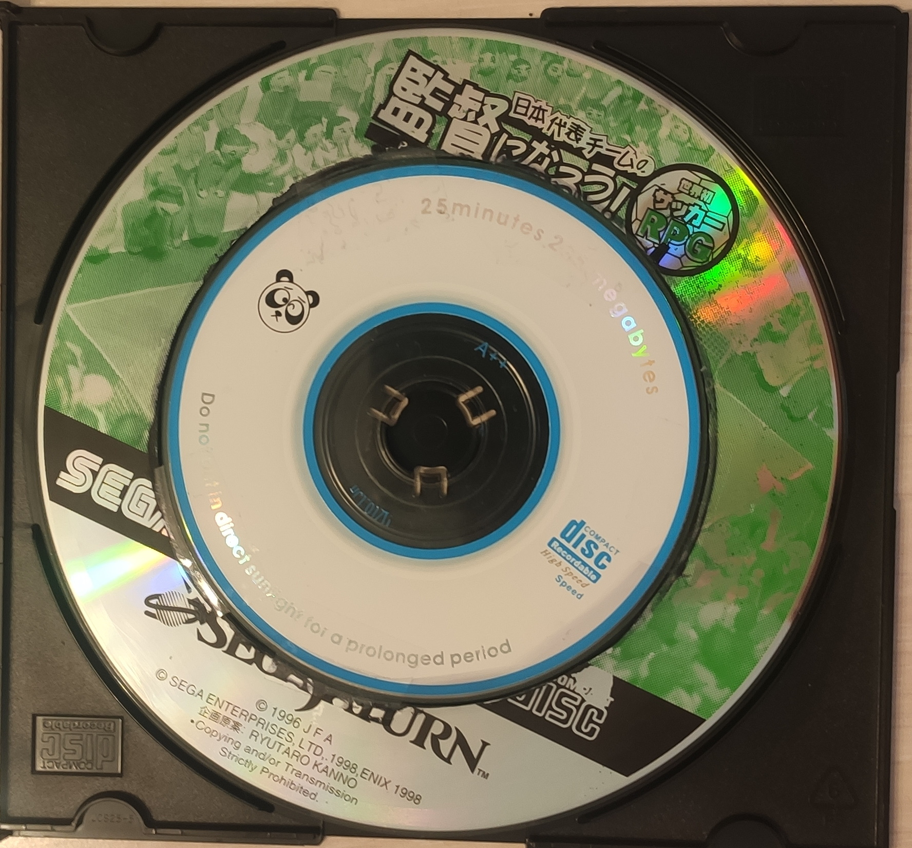
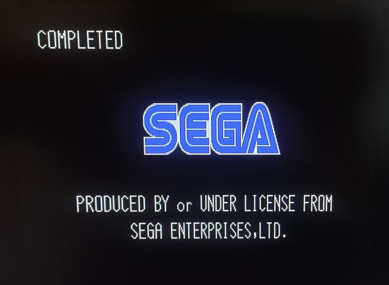
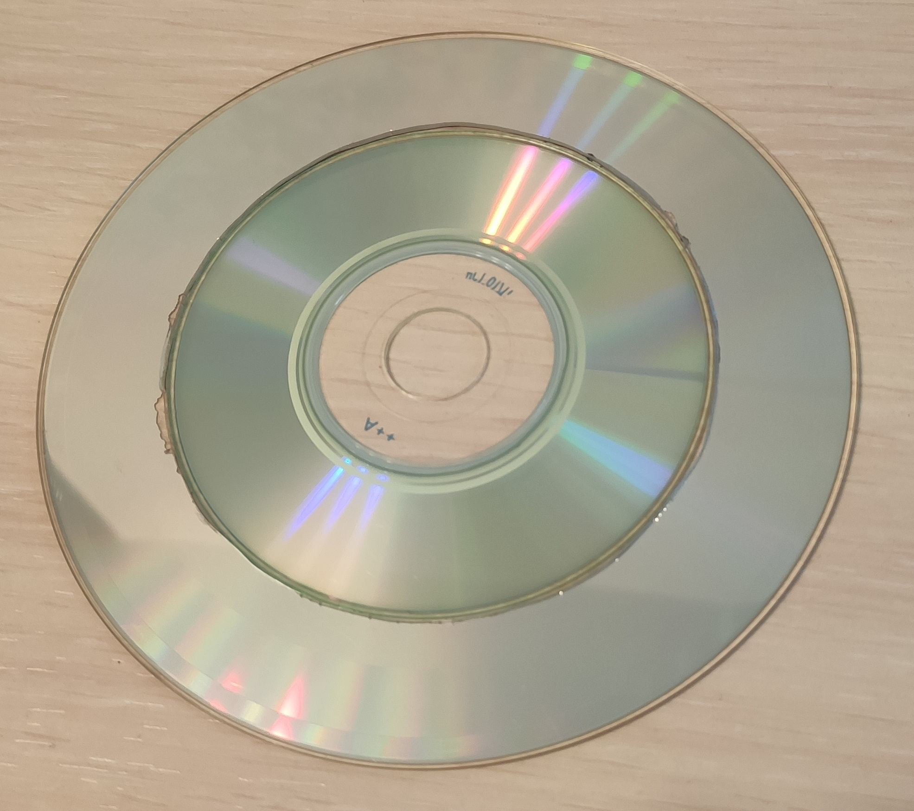

# Rings of Saturn

This is a compilation of knowledge on Sega Saturn System disk and a method of its replication called the 'Rings of Saturn'.

## Table of Contents
1. [What is the Rings of Saturn](#what-is-the-rings-of-saturn)
2. [Sega Saturn System Disc (KD01 and KD02)](#sega-saturn-system-disc-kd01-and-kd02)
3. [System Disc operation](#system-disc-operation)
4. [Splicing the Saturn Rings](#splicing-the-saturn-rings)
5. [Making Hot Swap easier without destroying any original disks](#making-hot-swap-easier-without-destroying-any-original-disks)
6. [Related interesting info](#related-interesting-info)


## Disclaimer

I acquired this information while researching online and experimenting. The results described here are not new. I've tried to document everything I found purely for tinkering and historical reasons.

Here I assume that you're already familiar with the hot swap trick and can perform it. I won't go into its details as it's extensively covered in many other sources. [Here's one as an example.](https://www.racketboy.com/retro/sega-saturn-model-2-swap-trick)

## What is the Rings of Saturn

Basically, the idea is to burn a Saturn System Disk (KD01 or KD02) on a miniCD and splice it with the outer ring cutout from any original Saturn game CD (the original CD is sacrificed). The cutout contains the security section that will enable miniCD to boot. This trick allows to bypass Saturn's copy protection (DRM) and run burned CD-Rs.

It is by far NOT the go to method of playing Saturn games. **It is much more convenient to use Pseudo Saturn cartriage, which also has a lot of extra features.** Though, it may be a bit pricy, compared to this method.

## Sega Saturn System Disc (KD01 and KD02)

The System Disc was a special disk made for Saturn game developers. The disk allowed to disable console's copy protection and boot burned games form any CD-R. The original System Discs are still can be found, but are considered collectors items and often strike a high price.

There's two kins of System Disc: KD01 and KD02. The former disables DRM for Sega published games (game image header = SEGA ENTERTAINMENT), the latter is for all the other games (game image header = SEGA TP).

You don't need two system disks to run all games, the either one is sufficient, as the publisher id can be patched with [Sega Region Patcher](https://madroms.satakore.com/) before the game is burned onto a CD-R.

Note, the System Disk does not disable the region lock, you will still need to patch the game region if doesn't match that of your console.

## System Disc operation

1. Put the System Disc in the console and power it on.
2. Wait for the "COMPLETED" message that appears at the top left corner screen.
3. The console can now boot any burned CD. You can reset console and change game disks.

#### Important notes
- If you running the System Disc using the hot swap method, you'll need to **remove the duct tape (or whatever you use) from the disk door switch**. The console needs to read the TOC from the newly inserted game and it only does so after it detects that the disk door was opened. Pushing the reset button won't be enough.
- The DRM inhibition retains even after the console has been reset. You only need to boot the System Disc once per power cycle.

### System Disc images

The KD02 image is [available at archive.org](https://archive.org/download/redump.ss.revival).
All the KD01 links I've found on the Internet are now dead.

### Booting the burned System Disk

Before you start cutting things with a dremel, first ensure that the System Disc image you've burned is working on your Saturn.

It is highly recommended to use miniCD for the System Disc as it reduces amount of things you need to cut. Also, it proves to be very difficult to cut a full-sized CD-R, as the disk's reflective layer does not tolerate machining of any kind and is easily destroyed.

After burning the KD02 image, try to boot the disk using the hot swap method. Successful boot can be determined by the "SEGA" startup screen with the "COMPLETED" message that appears at the screen top left corner.



#### Overcoming problems with booting System Disk KD02 (KD01 may also apply)

On some consoles the burned KD02 won't trigger the DRM readout and hence won't boot. The KD02 image takes just over 10Mb, but the executable part is only the first 1MB track, the rest is just dummy audio tracks. Try replacing those dummy tracks (i.e. starting from the second) as to fill the disk full (with other dummy audio tracks). I recommend to fill it beyond the actual miniCD capacity and select overburn option in the burning software. This will result in burn failure, but it's fine. The console won't care that the data at the end of the disk is malformed.

This was the crucial step in my case, as my console refused to boot the unmodified KD02 image.

## Splicing the Saturn Rings

For this part you'll need to destroy an original Saturn game. Try to use only shitty games that have no value or those that are not working properly due to scratches, etc. Always research if the game you want to destroy is valuable.

The process is roughly as follows.

1. Align the centers of the Saturn game disk and the miniCD, draw a contour of the miniCD on the game disk.
2. Cut the Saturn disk 3-4 mm from the drawn contour (inside) with a dremel cutting-disk bit.
3. Use sanding barrel bit to smooth the edge out, make is as close to the drawn contour as possible. The resulting cutout should be ~1mm larger in radius than the miniCD.
4. Using any other CD as a template align the cutout ring and the miniCD and loosely tape it together.
5. Put the spliced disk on the console spindle, rotate it manually while improving alignment of the miniCD and the outer ring by reapplying the adhesive tape and shifting everything slightly.
6. Try to power on the console. If the disk does not work, continue to improve the alignment of the disks, until it does. The indication of the bad alignment is when the laser head stops or jiggles right around the splicing region of the disk.
7. After achieving reliable operation of the disk, secure it with more tape or glue.

Note 1. Be very careful when removing the adhesive tape from the game disk cutout. The reflective layer is very gentle and tends to come off with the tape. If you damage the reflective layer too much, the disk will be ruined.

Note 2. The absolute maximum width of the non-reflective gap between the disks is 3mm. Anything beyond this and the laser won't travel to the outer edge to read the DRM section.



## Making Hot Swap easier without destroying any original disks

Preface. The "COMPLETED" message indicates that the DRM was disabled, however, if you don't see the message, it doesn't mean that the DRM inhibition has failed. In fact, it is not necessary to actually boot the System Disk. The magical part that disables the DRM is located in the TOC section of the System Disk, which is being read BEFORE the DRM check is performed.

Exploiting this fact makes the hot swap trick much easier, because you can get away without the need of the second swap entirely! It is a very big deal especially for the v2 consoles where the second swap is fairly hard to do due to the very small and non-deterministic time window.

The process is then as follows.
1. Tape or short out the disk door switch as usual for the hot swap.
2. Put in the burned System Disk and power on the console.
3. Swap to the original CD for the security check as usual.
4. After the security section has been read, instead of swapping back to the System Disk, **restore the door switch normal operation**, remove the disk from the console and hit the reset button.
5. The system is now ready to boot any burned game. Put the disk in, close the lid and it will work. You can also change the games and reset the system freely. The System Disk swap trick needs to be repeated only when you power off the console.

## Related interesting info

```
1. Physical level.
- Saturn CDs are modified 74min/650MB media.
- roughly in LBA range 297000..297700 there is featureless transition area separating ring from user data.
it's estimated to be about 34 spiral revolutions (for reference - there is no actual spiral there),
but being variable it can also be twice as wide.
- ring itself lasts up until LBA ~328300, spanning approx. 1460 revolutions
it is pressed in such a way that all revolutions in this area contain the same amount of data - parameter is element length,
in contrast to an ordinary CD, where element length is fixed and so data capacity increases a little with every next revolution:
74min: ~36 additional channel bits per revolution
80min: ~34 ...
90min: ~30 ...
99min: ~27 ...
- rings do differ (even though a little) from CD to CD because of variable area width and logical level differences.
2. Logical level.
- 283649 is defined as last sector for user data, so both: featureless area and ring always end up outside TOC
assuming Lead-Out lasts for 6750 sectors, ther still would be sectors left inbetween user data and featureless area
those sectors are filled the same way Lead-Out is - audio silence in main channel, sub-channel continue as Lead-Out
so one can say that Lead-Out lasts up until transition area.
- ring's main channel data, when unscrambled, reveals Sub-Header: 00 00 28 00 and EDC set to 0
Sub-Header Submode byte 28h translates into:
00101000b -> Data = 1, Form = 1 (Form2)
- when left scrambled, main channel user data form patterns consisting of A8h and 59h bytes.
those bytes yield somewhat opposite pit/land sequences:
59h producing long continuous runs, A8h - frequent changes
- when interleaved those patterns form visible inscription: 59h being background and A8h data,
with each revolution taking up exactly 21 sector.
each sector consist from 98 channel frames and ther's 588 channel bits in each frame,
thus on physical level ther's always 21*98*588=1210104 channel bits in this area per revolution.
- main channel ring data is always the same - it can start or cut out little sooner or later but relevant data itself is the same -
those differences that occur do not affect inscription, it's rather an leading/trailing background-only buffer zone.
- ring's sub-channel data is still continuation of Lead-Out with alternating P-Channel, Control set to 0 as for Audio,
TNO set to AAh and MIN, SEC and FRAC referring to Lead-Out's star, so it's slightly different for every CD.
- sub-channel's offset from main channel in ring area would often coincide with that in user data area
but sometimes it would not.
3. Misc notes.
- would ring be recorded on an ordinary CD, padded out by amount of sectors indicated in MSF (~297700),
it would end up then in area with approx. following initial (constantly increasing) channel bit capacity:
74min: 1246019
80min: 1217269
90min: 1160548
99min: 1119495
following approx. sector ranges would be mapped to area with channel bit capacity closest to that of the ring (1210104):
74min: 276463..276485 - it's user data area.
80min: 293255..293277 - range between user data and transition area - Lead-Out.
90min: 331628..331650 - unused sectors - slightly after ring
99min: 364785..364807 - unused sectors - well over 74min CD capacity
would it be padded to position at about the same radius as original,
channel bits per revolution towards the end of ring would reach then approx. following value: 1304069
- to pass System ID check and proceed for ring,
it's sufficient to have Mode1 track with identifier 'SEGA SEGASATURN ' at user data offset 0 in one of first 15 sectors.
- to disable further ring checks after 1st pass (a la System Disc),
it's enough to have additionally an valid Maker ID field and Product Number filled with special identifier 'SEGASYSTEM'
```

[Source](http://forum.redump.org/topic/3367/sega-saturn-cp-talk/) (2008)

